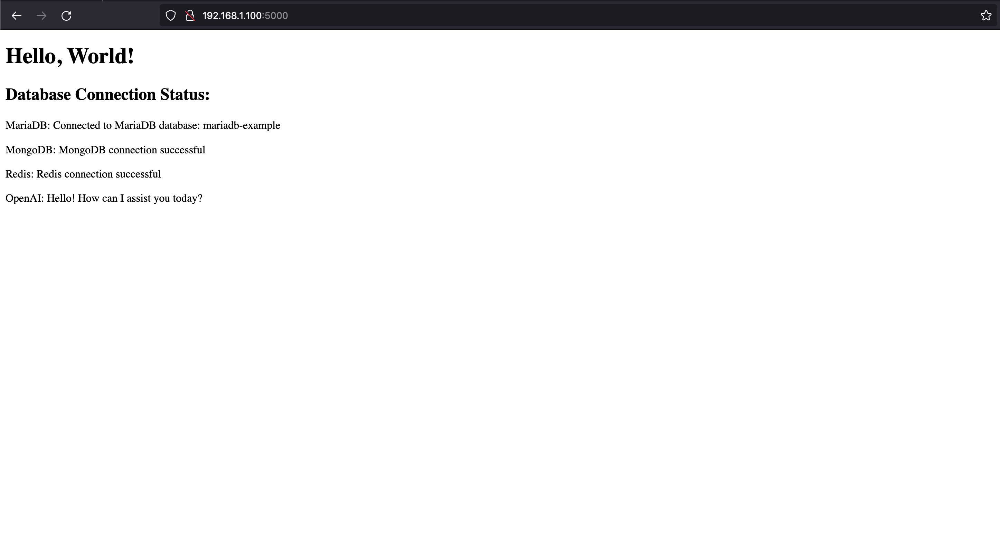
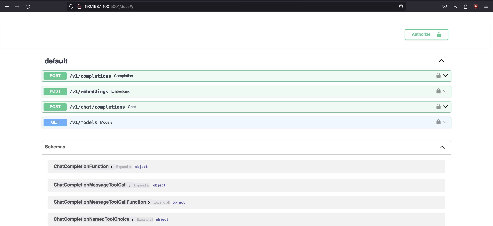
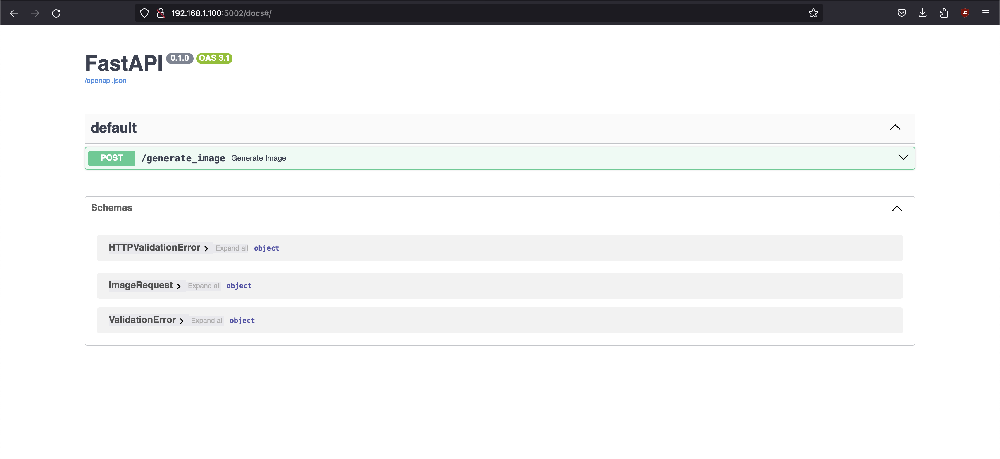

# Llama in a container

This README provides guidance for setting up a Dockerized environment with CUDA to run various services, including llama-cpp-python, stable diffusion, mariadb, mongodb, redis, and grafana.

## Prerequisites
- [Docker Engine Installation](https://docs.docker.com/engine/install/)
- [Nvidia Drivers Installation](https://www.nvidia.com/Download/index.aspx?lang=en-us)
- [Nvidia Container Toolkit Installation](https://docs.nvidia.com/datacenter/cloud-native/container-toolkit/latest/install-guide.html)
- [Nvidia CUDA Toolkit Installation](https://docs.nvidia.com/cuda/cuda-quick-start-guide/index.html)

## Setup
1. Change environment variables in .env (do not track changes to this file as it's not production-ready).

## Building and Running Containers
```sh
cd llama-docker
docker build -t base_image -f docker/Dockerfile.base . # build the base image
docker build -t cuda_image -f docker/Dockerfile.cuda . # build the cuda image
docker compose up --build -d # build and start the containers, detached

## useful commands
docker compose up -d # start the containers
docker compose stop # stop the containers
docker compose up --build -d # rebuild the containers
docker ps # list running containers
docker logs {container id} # show container logs
docker exec -it {container id} /bin/bash # enter container cli
```

## FastAPI/WebUI
- Access: http://{ip address}:5000


## llama-cpp-python OpenAI Compatible Server
- Access: http://{ip address}:5001/docs
- Model folder configuration: docker-compose.yml



### llama-cpp-python OpenAI Compatible Server API Configuration
- Multi-model support: [Configuration and Multi-model Support](https://llama-cpp-python.readthedocs.io/en/latest/server/#configuration-and-multi-model-support)
- Configuration file: llama_config.json
- OPENAI_BASE_URL and OPENAI_API_KEY are set in .env
  - Interchangeable between local and OpenAI API.

## Stable Diffusion
- Access: http://{ip address}:5002/docs
- Image saved to assets/sd_images



## Grafana
- http://{ip address}:7000
- username/password: admin/admin


## DB
- MariaDB {ip address}:6000
- MongoDB {ip address}:6001
- Redis {ip address}:6002

## Additional Resources
- [Redis Docs](https://redis.io/docs/)
- [MariaDB Docs](https://mariadb.com/kb/en/documentation/)
- [MongoDB Docs](https://www.mongodb.com/basics/get-started)
- [LLama Index Redis Vector Store](https://docs.llamaindex.ai/en/latest/examples/vector_stores/RedisIndexDemo.html#)
- [Langchain Docs](https://python.langchain.com/docs/get_started/quickstart)
- [Flask Docs](https://flask.palletsprojects.com/en/3.0.x/)
- [Grafana Docs](https://grafana.com/docs/grafana/latest/)
