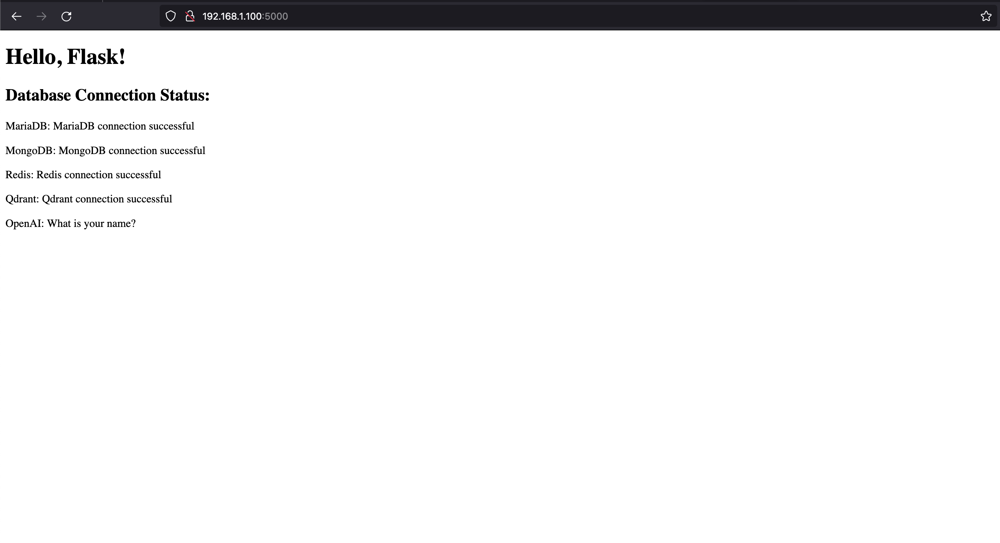

llama-cpp-python, dockerized with cuda.

llama-docker
- cuda
- flask
- mariadb
- mongodb
- redis
- qdrant
- TODO: stable diffusion

Host system requires docker engine, nvidia drivers, nvidia-container-toolkit, nvidia-cuda-toolkit

- Docker: https://docs.docker.com/engine/install/
- nvidia container toolkit: https://docs.nvidia.com/datacenter/cloud-native/container-toolkit/latest/install-guide.html
- nvidia cuda toolkit: https://docs.nvidia.com/cuda/cuda-quick-start-guide/index.html

Change your environment variables in .env, don't track changes to the file. This is not production ready.

```sh
cd llama-docker
docker build -t base_image -f Dockerfile.base .

docker compose up -d # start the containers
docker compose stop # stop the containers
```

After making changes, rebuild the containers:
```sh
docker compose up --build -d
```

## Flask server
- Point web browser to http://{ip address}:5000



## llama-cpp-python OpenAI compatible server

Accessible at http://{ip address}:5001

Configured with multi-model support: https://llama-cpp-python.readthedocs.io/en/latest/server/#configuration-and-multi-model-support

Your model folder is configured in the docker-compose.yml file. This is where your .gguf model files should be placed. Mine are located at "~/llm/models" and that folder is mounted to /models inside the container.

The internal port is 8080, we map it out to 5001 for external access.

```YAML
services:
  ...
  cuda:
    ...
    volumes:
      - ./cuda:/app
      - ~/llm/models:/models
```

API configuration is handled in llama_config.json. I strongly suggest you familiarize yourself with the llama-cpp-python documentation!

```sh
docker compose up -d

[+] Running 6/6
 ✔ Container llama-docker-qdrant-1   Running                                                                                                                         0.0s 
 ✔ Container llama-docker-mongo-1    Running                                                                                                                         0.0s 
 ✔ Container llama-docker-redis-1    Running                                                                                                                         0.0s 
 ✔ Container llama-docker-mariadb-1  Running                                                                                                                         0.0s 
 ✔ Container llama-docker-cuda-1     Running                                                                                                                         0.0s 
 ✔ Container llama-docker-flask-1    Started                                                                                                                         1.2s     
```

```sh
docker ps

CONTAINER ID   IMAGE                COMMAND                  CREATED             STATUS             PORTS                                                 NAMES
48ee8e97be62   llama-docker-flask   "gunicorn -w 2 -b :5…"   57 minutes ago      Up 57 minutes      0.0.0.0:5000->5000/tcp, :::5000->5000/tcp             llama-docker-flask-1
a210a68f4551   llama-docker-cuda    "python3 -m llama_cp…"   About an hour ago   Up About an hour   0.0.0.0:5001->8080/tcp, :::5001->8080/tcp             llama-docker-cuda-1
f0f8411cd57a   qdrant/qdrant        "./qdrant --uri http…"   About an hour ago   Up About an hour   6334/tcp, 0.0.0.0:5005->6333/tcp, :::5005->6333/tcp   llama-docker-qdrant-1
2f33a5c8f961   mariadb              "docker-entrypoint.s…"   About an hour ago   Up About an hour   0.0.0.0:5002->3306/tcp, :::5002->3306/tcp             llama-docker-mariadb-1
623f68ec83af   mongo                "docker-entrypoint.s…"   About an hour ago   Up About an hour   0.0.0.0:5003->27017/tcp, :::5003->27017/tcp           llama-docker-mongo-1
67b5f456921a   redis                "docker-entrypoint.s…"   About an hour ago   Up About an hour   0.0.0.0:5004->6379/tcp, :::5004->6379/tcp             llama-docker-redis-1
```

```sh
docker logs <container id>

...
...
llama_new_context_with_model:      CUDA0 compute buffer size =   194.00 MiB
llama_new_context_with_model:  CUDA_Host compute buffer size =   194.00 MiB
AVX = 1 | AVX_VNNI = 0 | AVX2 = 1 | AVX512 = 1 | AVX512_VBMI = 1 | AVX512_VNNI = 1 | FMA = 1 | NEON = 0 | ARM_FMA = 0 | F16C = 1 | FP16_VA = 0 | WASM_SIMD = 0 | BLAS = 1 | SSE3 = 1 | SSSE3 = 1 | VSX = 0 | 
INFO:     Started server process [1]
INFO:     Waiting for application startup.
INFO:     Application startup complete.
INFO:     Uvicorn running on http://0.0.0.0:8080 (Press CTRL+C to quit)
```

## Qdrant vector db
https://python-client.qdrant.tech/

## llama-index
https://docs.llamaindex.ai/en/stable/examples/vector_stores/QdrantIndexDemo.html

## langchain
https://python.langchain.com/docs/get_started/quickstart